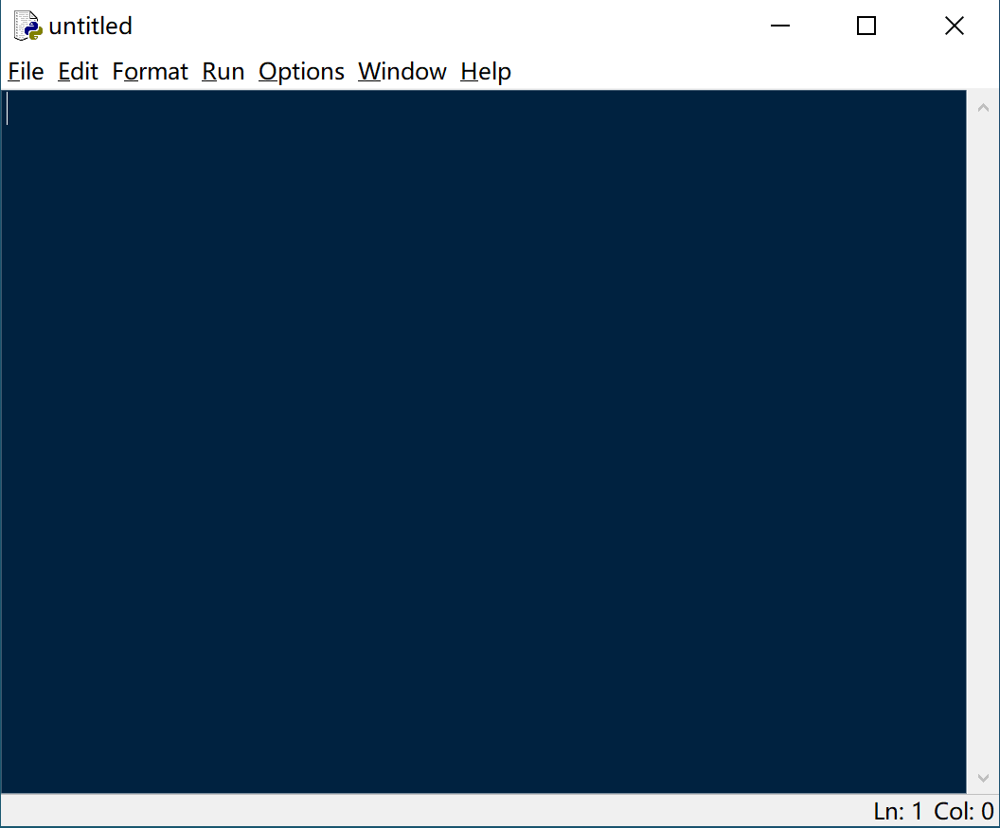

# 【Python入门】第1课：第一行代码

## 下载和安装

Python安装包可以在[Python官网](https://python.org)下载。


下载后打开安装包根据指示完成安装，在步骤中可一律选择默认。


安装成功后你的电脑里会获得多个应用程序，其中包括**IDLE**（Integrated Development and Learning Environment）的应用程序，就是**集成开发与学习环境**，写代码和运行代码都可以在这个应用程序里进行，此课程我们将主要使用它。


## 工具介绍

在IDLE执行Python代码有两种方式，使用**交互式命令行**（Interactive Shell）和使用**脚本文件**（Script File）。

打开IDLE后的第一个窗口为交互式命令行，窗口标题为Shell，“>>>”是**Python提示符**（Python Prompt），在Python提示符之后输入Python代码，按回车（Enter/Return）可以执行代码并获得输出。


在交互式命令行窗口菜单栏中点击**文件**（File）、**新建文件**（New File），可获得一个空白的脚本文件，新建的脚本文件的窗口标题为untitled，保存或另存为到本地时可自定义文件名。



在脚本文件内可以写多行Python代码并且作为文件保存。在脚本文件窗口点击**运行**（Run）、**运行模组**（Run Module）或者点击F5键，代码会逐行执行，在交互式命令行中获得输出。


## 第一行代码

在交互式命令行输入以下代码，然后按回车键。

```python
>>> print("Hello, World!")
Hello, World!
```

## 本节挑战

新建一个脚本文件，输入刚才的第一行代码，尝试从脚本文件中运行这行代码吧，看看发生了什么。

---
